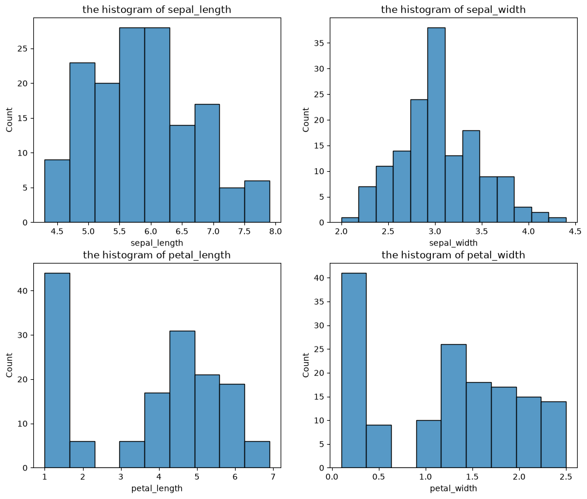
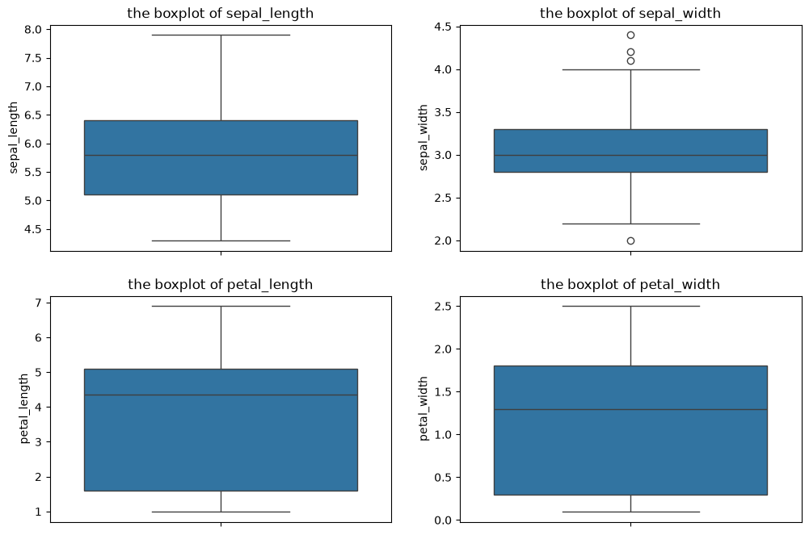
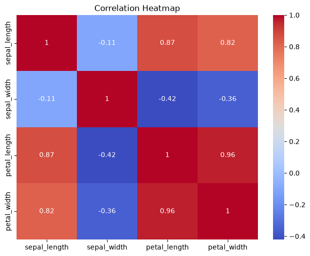
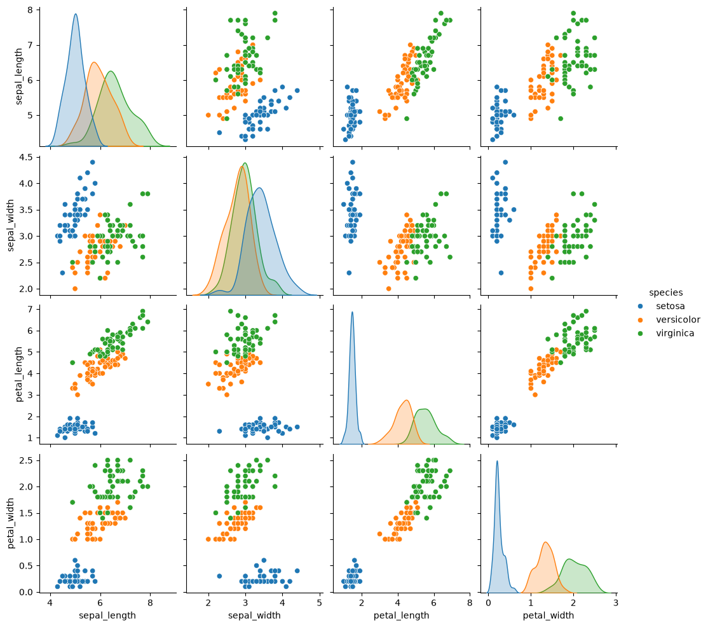

# Iris Flower Classification — A Machine Learning Workflow Walkthrough

This repository is a **learning project** built to explore and practice the end-to-end workflow of a supervised machine learning task — specifically **classification**. The goal is to classify iris flowers into one of three species (*setosa*, *versicolor*, *virginica*) based on their physical measurements.

> ⚠️ **Disclaimer:** This project is created purely for **educational purposes**. It is not intended for commercial use, and the dataset belongs to its original author (see credits below).

---

## 📊 Dataset

- **Source:** [Iris Dataset on Kaggle](https://www.kaggle.com/datasets/himanshunakrani/iris-dataset)
- **Size:** 150 rows, 4 numeric features + 1 categorical target
- **Features:** `sepal_length`, `sepal_width`, `petal_length`, `petal_width` (all in cm)
- **Target:** `species` (setosa, versicolor, virginica — 50 samples each, perfectly balanced)

### Descriptive statistics

| Statistic | sepal_length | sepal_width | petal_length | petal_width |
|-----------|-------------|-------------|---------------|--------------|
| count     | 150         | 150         | 150           | 150          |
| mean      | 5.84        | 3.05        | 3.76          | 1.20         |
| std       | 0.83        | 0.43        | 1.76          | 0.76         |
| min       | 4.3         | 2.0         | 1.0           | 0.1          |
| 25%       | 5.1         | 2.8         | 1.6           | 0.3          |
| 50%       | 5.8         | 3.0         | 4.35          | 1.3          |
| 75%       | 6.4         | 3.3         | 5.1           | 1.8          |
| max       | 7.9         | 4.4         | 6.9           | 2.5          |

---

## 🔍 Exploratory Data Analysis (EDA)

EDA was performed in [`notebook/EDA.ipynb`](./notebook/EDA.ipynb) to understand feature distributions, relationships, and outliers before training the model.

### 1. Feature distributions

Histograms show that `petal_length` and `petal_width` are **not unimodal** — they display a clear separation, hinting that these two features carry strong class-discriminative information.



### 2. Outlier check

Boxplots confirm the dataset is mostly clean, with only a few mild outliers in `sepal_width`.



### 3. Correlation heatmap

`petal_length` and `petal_width` are **strongly correlated with each other (0.96)** and also strongly correlated with `sepal_length` (0.87 and 0.82 respectively), while `sepal_width` behaves almost independently and is even slightly negatively correlated with the petal features.



### 4. Pairplot by species

The pairplot is the clearest evidence: when colored by species, **petal_length vs petal_width** produces the most visually separable clusters among the three species, with almost no overlap for *setosa* and only minor overlap between *versicolor* and *virginica*.



### 🔑 Key findings

- **`petal_length` and `petal_width` are the two strongest predictors** for distinguishing the three iris species — they separate the classes far more cleanly than the sepal measurements.
- *Setosa* is linearly separable from the other two species using petal measurements alone.
- *Versicolor* and *virginica* have some overlap but are still largely distinguishable.

---

## 🤖 Model Training

Model training was done in [`src/trainModel.ipynb`](./src/trainModel.ipynb) using **Logistic Regression**, a simple and interpretable baseline classifier for multi-class classification.

**Workflow:**
1. Load the raw dataset and encode the categorical `species` label with `LabelEncoder`.
2. Split data into training/testing sets (80/20, stratified by class).
3. Train a `LogisticRegression` model (`max_iter=200`).
4. Evaluate using accuracy score and classification report.
5. Serialize the trained model with `joblib` for later reuse.

### Results

The Logistic Regression model achieved an **accuracy of ~96.7%** on the held-out test set:

| Class | Precision | Recall | F1-score |
|-------|-----------|--------|----------|
| setosa (0)     | 1.00 | 1.00 | 1.00 |
| versicolor (1) | 1.00 | 0.90 | 0.95 |
| virginica (2)  | 0.91 | 1.00 | 0.95 |

**Overall accuracy: 0.97 (30 test samples)**

This confirms the EDA findings — since petal measurements separate the classes so well, even a simple linear model like Logistic Regression performs very strongly (>90% accuracy) on this dataset.

The trained model is saved as [`model/iris_logistic_model.pkl`](./model/iris_logistic_model.pkl).

---

## 📁 Project Structure

```
.
├── data/
│   ├── processed/
│   │   ├── describeData.csv
│   │   ├── Heatmap.png
│   │   ├── histogram.png
│   │   ├── outliers.png
│   │   └── pairplot.png
│   └── raw/
│       └── iris.csv
├── model/
│   └── iris_logistic_model.pkl
├── notebook/
│   └── EDA.ipynb
├── src/
│   └── trainModel.ipynb
├── requirement.txt
└── README.md
```

---

## 🚀 How to Run

1. Clone the repository and install the dependencies:
   ```bash
   pip install -r requirement.txt
   ```
2. Run `notebook/EDA.ipynb` to reproduce the exploratory analysis and plots.
3. Run `src/trainModel.ipynb` to retrain the model and regenerate `model/iris_logistic_model.pkl`.

---

## 📌 Credits

- Dataset: [Iris Dataset — Himanshu Nakrani, Kaggle](https://www.kaggle.com/datasets/himanshunakrani/iris-dataset)
- Purpose: Educational only — a hands-on practice of the classic ML classification workflow (EDA → preprocessing → training → evaluation → serialization).